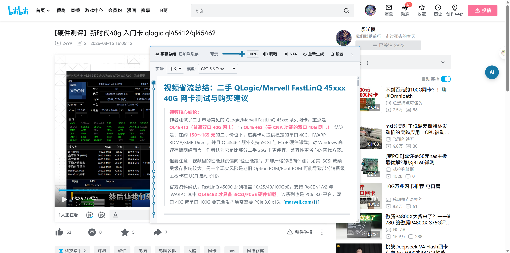
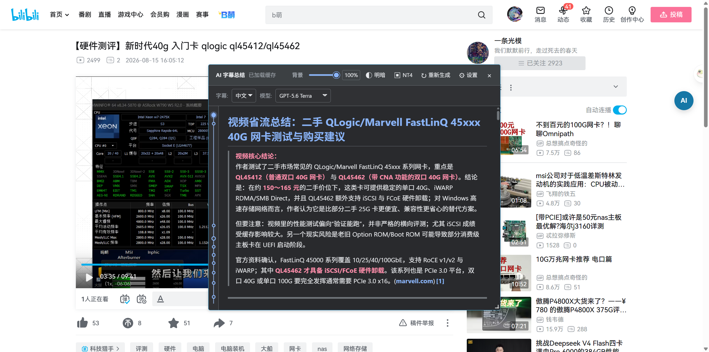
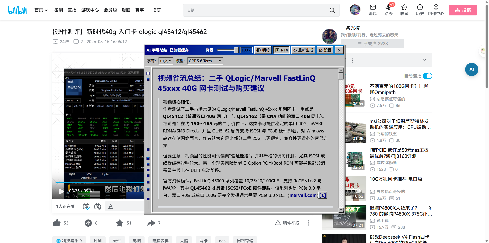
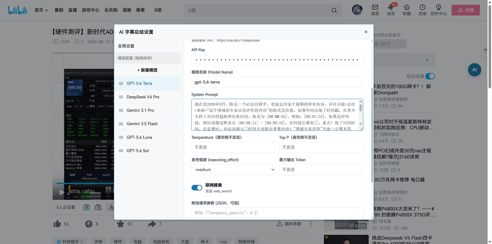
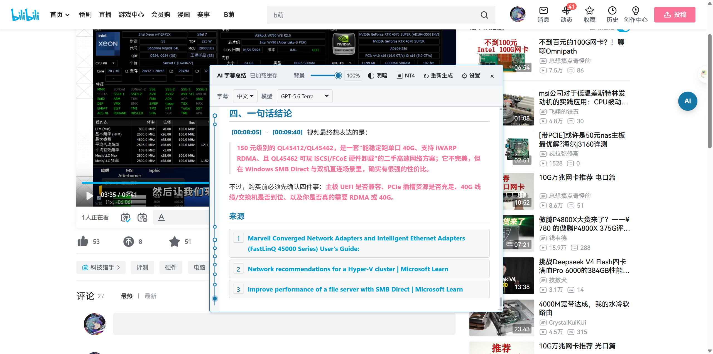
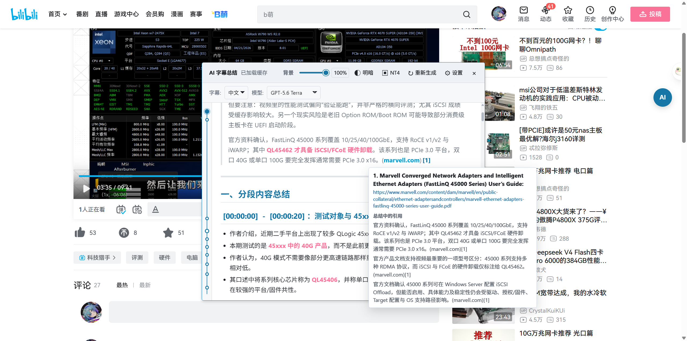

# Bilibili CC 字幕 AI 总结


基于 Tampermonkey / Violentmonkey 的 Bilibili AI 字幕总结脚本。它读取视频 CC 字幕，调用你配置的 AI 服务，输出带时间轴、Markdown、表格和专家评价的总结，并把结果缓存在浏览器本地。

`main.js` 当前对应用户脚本 `Bilibili_CC_Subtitles_AISummary` **4.2.2**。本项目不收集 API Key、字幕或总结内容。

## 真实界面截图

下面 4 张图均来自新版 4.2.2 脚本在真实 Bilibili 视频页面上的实际运行结果，视频为 [BV1EKbC6FEGh：新时代 40G 入门卡 QLogic QL45412/QL45462](https://www.bilibili.com/video/BV1EKbC6FEGh/)。页面包含真实 CC 字幕，面板中的文字是脚本生成的真实总结，不是静态 UI 模拟图。

设置截图中的 API Key 已由脚本界面遮罩；README 不包含任何可用密钥。

| Light / 浅色 | Dark / 深色 |
| --- | --- |
|  |  |

| Windows NT4 主题 | Settings / 设置（API Key 已遮罩） |
| --- | --- |
|  |  |

引用也会在总结末尾集中列出。把鼠标移动到正文中的 `[1]`、`[2]` 等引用标记上，会显示包含标题、链接和对应原文片段的悬浮卡片：




## 中文说明

### 核心功能

- 自动读取 Bilibili CC / 自动生成字幕；视频有多条字幕时可以切换语言。
- 悬浮球打开总结面板，面板支持拖动、缩放和背景透明度调节。
- 提供浅色、深色和 Windows NT4 三种界面主题。
- Markdown 和 KaTeX 渲染；`[HH:MM:SS]` 时间戳可以点击跳转到视频位置。
- 支持 OpenAI Chat Completions、OpenAI Responses、Gemini 原生 `generateContent` 三种 API 格式。
- 支持联网搜索和来源引用；是否能搜索取决于模型和代理服务商。
- 使用 IndexedDB 缓存总结。相同视频、字幕语言和模型配置再次打开时优先读取本地结果。
- 模型配置可拖拽排序，可新增多个模型，并提供“测试当前配置”和原始响应报告。
- 支持自定义 System Prompt、Temperature、Top P、思考强度、最大输出 Token、附加 JSON 参数和代理。

### 安装

1. 安装 [Tampermonkey](https://www.tampermonkey.net/) 或 [Violentmonkey](https://violentmonkey.github.io/)。
2. 打开本仓库的 [`main.js`](main.js)，选择“安装”；或者复制文件内容到脚本管理器的新建脚本中。
3. 访问支持的 Bilibili 视频页。播放器右侧出现 `AI` 悬浮球后即可使用。

脚本通过 `@require` 加载 `marked` 和 KaTeX。如果 CDN 被网络环境拦截，请检查脚本管理器的外部资源加载权限。

### 快速使用

1. 点击右侧 `AI` 悬浮球。
2. 在工具栏选择字幕语言和模型。
3. 没有缓存时点击“点击开始生成摘要”。
4. 生成完成后，点击总结中的蓝色时间戳跳转视频。
5. 点击刷新按钮可忽略缓存并重新生成；这会再次发送字幕并可能产生 API 费用。
6. 点击齿轮进入设置，首次使用请先填写 API URL、API Key 和模型名称。

### API 配置

设置路径：`AI 字幕总结 → 设置 → 模型配置 → 新建模型`。

| 字段 | 作用 |
| --- | --- |
| 配置名称 | 仅用于界面显示。 |
| API 格式 | 选择 OpenAI Chat、OpenAI Responses 或 Gemini 原生接口。 |
| API URL | OpenAI 可以填服务根地址或完整端点；Gemini 原生地址使用 `{model}` 占位符。 |
| API Key | OpenAI 格式使用 Bearer；Gemini 使用 `x-goog-api-key`。 |
| 模型名称 | 服务商要求的模型 ID。 |
| System Prompt | 自定义总结语言、结构和分析角度。 |
| Temperature / Top P | 可留空；范围分别是 `0..2` 和 `0..1`。 |
| 思考强度 | 映射到 Responses 或 Gemini 的 thinking 配置。 |
| 最大输出 Token | 按 API 格式映射到对应字段。 |
| 联网搜索 | 向兼容接口发送搜索工具参数。 |
| 附加请求参数 | 可选 JSON 对象，例如 `{"frequency_penalty":0.2}`。 |
| Proxy | 可选，例如 `http://127.0.0.1:7897`；是否生效取决于脚本管理器。 |

#### OpenAI 兼容接口示例

```text
API 格式: OpenAI / NewAPI Chat Completions
API URL:  https://api.example.com/v1
API Key:  <your-key>
模型名称: example-model
Proxy:    http://127.0.0.1:7897
```

根地址会自动解析为 `/v1/chat/completions`。如果服务商路径不同，请填完整 URL。

#### Gemini 原生接口示例

```text
API 格式: Gemini 原生 generateContent
API URL:  https://generativelanguage.googleapis.com/v1beta/models/{model}:generateContent
API Key:  <your-key>
模型名称: gemini-3.5-flash
```

设置页会显示“实际请求 URL”，便于在测试前检查模型占位符是否解析正确。

### 缓存、隐私和费用

- 总结缓存保存在浏览器 IndexedDB，数据库名为 `BiliAISummaryDB`。
- 字幕只会发送到你自己配置的 AI 服务商；项目作者无法读取 API Key、字幕或总结。
- API 服务商可能记录请求并收取费用，请自行查看其隐私政策和价格。
- 重要结论请回看原视频核对，AI 总结和时间戳可能存在误差。

### 常见问题

**没有 AI 悬浮球？** 确认脚本已启用，且 URL 属于脚本头部 `@match` 范围；等待播放器加载或刷新页面。

**提示无字幕？** 当前视频没有可用 CC/自动字幕时无法生成总结。请尝试带有 CC 标识的视频。

**API 请求失败？** 检查 URL、Key、模型 ID 和 API 格式；进入设置点击“测试当前配置”查看状态码和原始响应。

**代理不生效？** 确认本机代理确实监听所填端口，并确认当前脚本管理器支持 `GM_xmlhttpRequest` 的 `proxy` 选项。

## English

### Overview

`main.js` is the 4.2.2 release of the `Bilibili_CC_Subtitles_AISummary` userscript. It reads real Bilibili CC captions, sends them to a user-configured AI provider, renders a timestamped Markdown summary, and caches the result locally with IndexedDB.

### Real screenshots

All six screenshots above were captured from the 4.2.2 script running on a real Bilibili page with real CC captions: [BV1EKbC6FEGh](https://www.bilibili.com/video/BV1EKbC6FEGh/). The summary text, timestamps, source citations, source list, hover card, and UI controls are from the live page. The API key in the settings screenshot is masked by the script UI.

### Features

- CC/auto-caption extraction with a language selector.
- Draggable, resizable summary panel with opacity control.
- Light, dark, and Windows NT4 themes.
- Markdown and KaTeX rendering with clickable timestamps.
- OpenAI Chat Completions, OpenAI Responses, and native Gemini `generateContent` formats.
- Optional web search and source citations when supported by the selected provider.
- IndexedDB cache keyed by video, caption language, and model configuration.
- Unlimited model presets, drag-to-reorder, connection testing, and raw response reports.
- Custom system prompt, temperature, top-p, reasoning effort, output-token limit, extra JSON parameters, and proxy.

### Installation

1. Install [Tampermonkey](https://www.tampermonkey.net/) or [Violentmonkey](https://violentmonkey.github.io/).
2. Install [`main.js`](main.js), or paste it into a new userscript.
3. Open a supported Bilibili video. Click the `AI` floating button.

### Configuration

Open `AI Summary → Settings → Model configuration → New model`. Select the provider format, enter the endpoint, API key, model ID, and optional prompt/parameters. OpenAI root URLs are expanded to `/v1/chat/completions` or `/v1/responses`; native Gemini URLs should contain `{model}`.

`temperature` and `top_p` may be blank. Extra parameters must be a JSON object. A proxy such as `http://127.0.0.1:7897` is only an example and depends on userscript-manager support.

### Privacy and limitations

Captions and summaries are sent only to the provider configured by the user. API keys are stored by the userscript manager. Provider-side logging, billing, and retention policies apply. AI output is not guaranteed to be correct; verify important information against the original video.

## License

MIT. See [`CHANGELOG.md`](CHANGELOG.md) for the documented update history.
