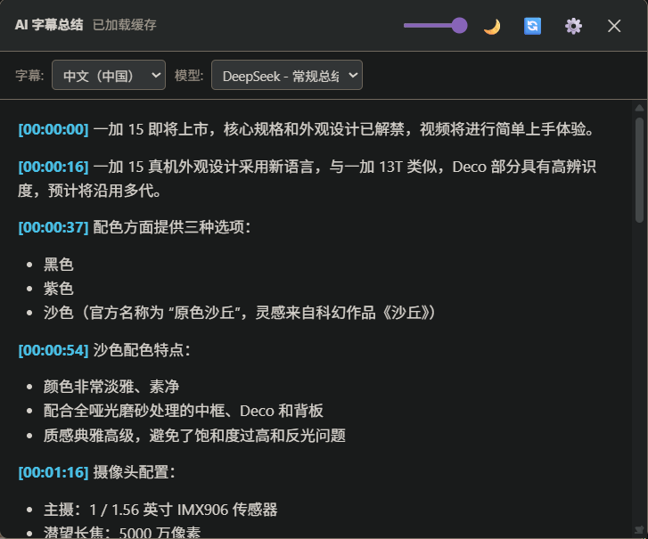

# Bilibili CC 字幕 AI 总结


一个面向 Bilibili 网页播放器的用户脚本。它读取视频 CC/自动生成字幕，调用可配置的 AI 模型生成带时间戳的 Markdown 总结，并把结果缓存在浏览器本地。脚本支持 OpenAI Chat Completions、OpenAI Responses 和 Gemini 原生 `generateContent` 三种请求格式。

> 当前脚本版本：`4.2.2`。API Key 只保存在用户脚本管理器的本地存储中，不会上传到本项目。

## Screenshots / 截图

以下截图展示主要面板和模型配置界面。截图用于说明布局和操作位置；不同脚本管理器、Bilibili 主题及版本可能存在细节差异。

| Summary panel / 总结面板 | Model settings / 模型设置 |
| --- | --- |
|  |  |

## 中文说明

### 功能

- 从 Bilibili 视频、番剧、课程、稍后再看和播放列表页面读取 CC 字幕；有多条字幕时可以选择语言。
- 通过悬浮球打开可拖拽、可缩放的总结面板；支持浅色、深色和 Windows NT4 风格主题。
- 渲染 Markdown 和 KaTeX，识别 `[HH:MM:SS]` 时间戳并点击跳转到视频位置。
- 支持引用来源和来源回溯；启用联网搜索时，OpenAI Responses 与 Gemini 原生接口可显示搜索来源。
- 同一视频、字幕语言和模型配置会写入 IndexedDB，重复打开时优先读取缓存，不重复消耗 Token。
- 模型配置支持拖拽排序、连接测试和测试报告；可以创建任意数量的自定义模型。
- 支持 `temperature`、`top_p`、`reasoning_effort`、最大输出 Token、附加 JSON 参数和每个配置独立的代理。
- 全局设置提供时间轴标题深度、Debug 日志开关和清空所有缓存功能。

### 安装

1. 安装 [Tampermonkey](https://www.tampermonkey.net/) 或 [Violentmonkey](https://violentmonkey.github.io/)。
2. 打开本仓库中的 [`main.js`](main.js)，点击脚本管理器的“安装”按钮；也可以在脚本管理器中新建脚本后粘贴文件内容。
3. 打开任意匹配的 Bilibili 页面，右侧会出现 `AI` 悬浮按钮。

脚本依赖 jsDelivr/BootCDN 上的 `marked` 和 KaTeX。若所在网络无法访问这些 CDN，请先确认脚本管理器允许跨域加载外部资源。

### 快速开始

1. 在视频页点击 `AI` 悬浮球。
2. 在工具栏选择字幕语言和模型配置。
3. 第一次使用某个“视频 + 字幕 + 模型”组合时，点击“点击开始生成摘要”。
4. 生成完成后，点击总结中的时间戳即可跳转；点击右上角刷新按钮可以忽略缓存并重新生成。
5. 点击齿轮进入设置。保存配置前建议先点击“测试当前配置”，检查状态码和原始响应。

### 模型配置

在“设置 → 模型配置 → 新建模型”中填写以下字段：

| 字段 | 说明 |
| --- | --- |
| 配置名称 | 仅用于界面显示，例如 `我的 Gemini`。 |
| API 格式 | 选择 `OpenAI / NewAPI Chat Completions`、`OpenAI Responses / OpenResponses` 或 `Gemini 原生 generateContent`。 |
| API URL | 可以填写完整端点，也可以填写服务根地址。OpenAI 格式会自动补齐 `/v1/chat/completions` 或 `/v1/responses`；Gemini 原生 URL 使用 `{model}` 占位符。 |
| API Key | OpenAI/兼容接口以 `Authorization: Bearer` 发送；Gemini 原生以 `x-goog-api-key` 发送。 |
| 模型名称 | 服务商要求的模型 ID。 |
| System Prompt | 控制总结结构、语言和分析角度；默认提示词要求返回中文 Markdown、分段、表格和专家评价。 |
| Temperature / Top P | 可留空以不发送；范围分别为 `0..2` 和 `0..1`。 |
| 思考强度 | 映射到 OpenAI Responses 的 `reasoning.effort`，或 Gemini 的 thinking 配置。 |
| 最大输出 Token | OpenAI Chat 使用 `max_completion_tokens`，Responses 使用 `max_output_tokens`，Gemini 使用 `maxOutputTokens`。 |
| 联网搜索 | OpenAI Responses 发送 `tools: [{"type":"web_search"}]`；Gemini 发送 `tools: [{"google_search":{}}]`；Chat Completions 发送 `web_search_options`，是否生效取决于代理站。 |
| 附加请求参数 | 可选 JSON 对象，例如 `{"frequency_penalty":0.2}`。模型输入、系统提示词和 `stream:false` 由脚本统一管理。 |
| Proxy | 可选，例如 `http://127.0.0.1:7897`。实际效果取决于 Tampermonkey/Violentmonkey 对 `GM_xmlhttpRequest` 的支持。 |

#### 示例：OpenAI 兼容接口

```text
API 格式: OpenAI / NewAPI Chat Completions
API URL:  https://api.example.com/v1
API Key:  <your-key>
模型名称: example-model
Proxy:    http://127.0.0.1:7897   # 仅在本机代理确实监听此端口时填写
```

脚本会把上面的根地址解析为 `https://api.example.com/v1/chat/completions`。如果服务商使用自定义路径，请直接填写完整 URL。

#### 示例：Gemini 原生接口

```text
API 格式: Gemini 原生 generateContent
API URL:  https://generativelanguage.googleapis.com/v1beta/models/{model}:generateContent
API Key:  <your-key>
模型名称: gemini-3.5-flash
```

不要把 Gemini 原生端点误选为 OpenAI Chat 格式；设置页会显示解析后的实际请求 URL。

### 数据、隐私和费用

- 字幕和总结只写入当前浏览器的 IndexedDB（数据库名：`BiliAISummaryDB`）；清除脚本管理器数据或点击“清除所有缓存数据”会删除本地总结。
- 字幕会发送到你在配置中填写的 API 服务商。项目作者无法读取你的 API Key、字幕或总结。
- API 调用可能产生费用，额度、日志留存和隐私政策由所选服务商决定。请不要在共享电脑中保存不应暴露的密钥。
- AI 输出可能不准确，时间戳也可能因字幕质量而偏移；重要信息请回看原视频核对。

### 常见问题

**没有出现 AI 悬浮球？** 确认 URL 属于脚本头部的 `@match` 范围，并等待 Bilibili 播放器加载完成；可以刷新页面或检查脚本管理器是否启用。

**提示“该视频无字幕”？** 脚本依赖 Bilibili 提供的 CC/自动字幕。没有可用字幕时无法生成总结。

**请求失败或跨域错误？** 检查 API URL、模型 ID 和 Key；确认脚本管理器允许 `GM_xmlhttpRequest`，并在设置中使用“测试当前配置”查看状态码。需要代理时填写完整代理 URL（例如 `http://127.0.0.1:7897`）。

**联网搜索没有来源？** 只有模型、代理站和所选 API 格式都支持搜索时才会返回来源；Chat Completions 的 `web_search_options` 不是所有服务商都实现。

**如何重新生成？** 点击面板右上角的刷新按钮。该操作会跳过当前缓存并重新发送字幕，可能再次消耗 Token。

## English

### Overview

`main.js` (the `Bilibili_CC_Subtitles_AISummary` userscript) is a userscript for the Bilibili web player. It reads CC or auto-generated captions, sends them to a configurable LLM, and renders a timestamped Markdown summary. Results are cached in the browser with IndexedDB. Version `4.2.2` supports three request formats: OpenAI Chat Completions, OpenAI Responses, and native Gemini `generateContent`.

### Features

- Caption-language selector for videos with multiple CC tracks.
- Draggable and resizable floating summary panel with light, dark, and Windows NT4 themes.
- Markdown and KaTeX rendering; clickable `[HH:MM:SS]` timestamps seek the player.
- Optional web search with source citations for compatible OpenAI Responses and Gemini endpoints.
- IndexedDB cache keyed by video, caption language, and model configuration.
- Unlimited model presets, drag-to-reorder, connection test, and a raw response test report.
- Per-model system prompt, temperature, top-p, reasoning effort, output-token limit, extra JSON parameters, and proxy.
- Global controls for timeline heading depth, debug logging, and clearing all cached summaries.

### Installation and first run

1. Install [Tampermonkey](https://www.tampermonkey.net/) or [Violentmonkey](https://violentmonkey.github.io/).
2. Install [`main.js`](main.js) from this repository, or paste its contents into a new userscript.
3. Open a supported Bilibili video page and click the `AI` floating button.
4. Choose a caption language and model, then click **Start summary generation**.
5. Open **Settings** to add an API key. Use **Test current configuration** before saving.

### Provider formats

| Format | Request shape | Authentication | Search flag |
| --- | --- | --- | --- |
| OpenAI Chat Completions | `POST /v1/chat/completions` | `Authorization: Bearer <key>` | `web_search_options` (provider-dependent) |
| OpenAI Responses | `POST /v1/responses` | `Authorization: Bearer <key>` | `tools: [{"type":"web_search"}]` |
| Gemini native | `POST .../models/{model}:generateContent` | `x-goog-api-key: <key>` | `tools: [{"google_search":{}}]` |

The URL resolver accepts either a service root or a complete endpoint for OpenAI-compatible services. Gemini URLs should contain `{model}` so the model name can be substituted safely.

### Configuration notes

- Leave numeric fields blank to omit them from the request. `temperature` must be between 0 and 2; `top_p` must be between 0 and 1.
- **Extra request parameters** must be a JSON object. Do not use it to override the subtitle input, system prompt, or streaming flag.
- **Proxy** is passed to `GM_xmlhttpRequest` as `options.proxy`; support varies by userscript manager. `http://127.0.0.1:7897` is only an example and must match a proxy running on your machine.
- Web search may increase latency and cost. Search support is controlled by the selected endpoint or gateway, not by this script alone.

### Privacy and limitations

API keys, captions, and summaries are stored or transmitted according to your userscript manager and selected provider. The project does not receive them. API usage may cost money, and AI summaries can contain errors; verify important claims against the original video.

## License

MIT. See [`CHANGELOG.md`](CHANGELOG.md) for the documented 4.2.2 feature baseline and update history.
